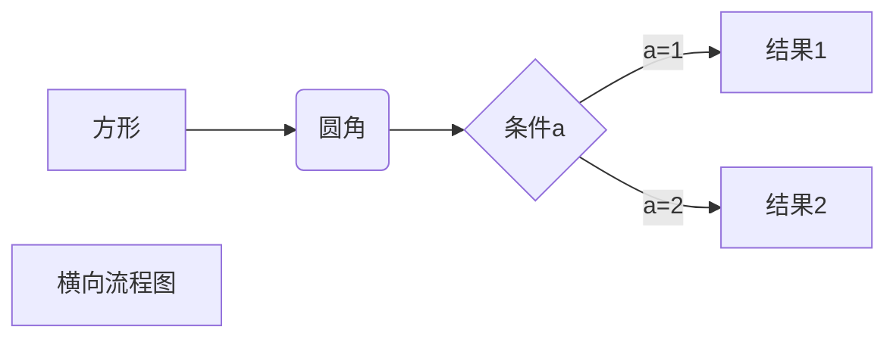

# 一个标准的 vue 组件

```vue
<template>
    <div>
        <li v-for="i in 100" :key="i">{{ 100 - i }}</li>
    </div>
</template>

<script>
export default {
    components: ['CompA'],
    mounted() {},
};
</script>

<style></style>
```

```js
import Vue from 'vue';
import App from './App.vue';

Vue.config.productionTip = false;

// 代码高亮
import 'prismjs/themes/prism.css';

// 引入iview
import './plugins/iview.js';
// 引入axios
import './plugins/axios.js';

// router
import router from './router/';

// 引用组件动态添加删除管理器
import compManager from './plugins/comp-manager/';
Vue.use(compManager, { router });

new Vue({
    router,
    render: h => h(App),
}).$mount('#app');
```

